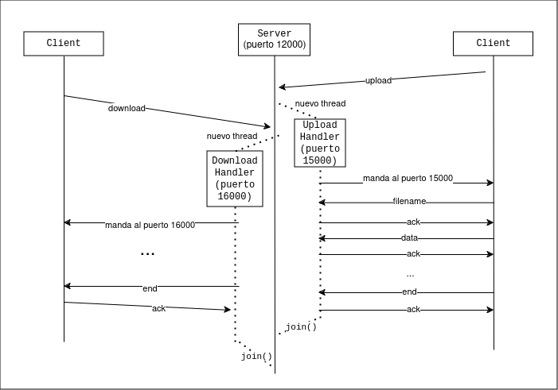

## Idea

La idea es que el thread principal del server solo reciba los requests de upload / download.
Cada vez que llega un request, el server lanza un thread con un UploadHandler o DownloadHandler
dependiendo el caso.

La diferencia entre esta implementación y la que hicimos antes es que en la anterior el thread principal recibe todos los mensajes, ya sean requests, data, acks, etc, y tiene que repartir cada uno a su thread correspondiente, mientras que en esta implementación el thread principal recibe solo requests y le delega el resto de mensajes a los handlers.

El UploadHandler utiliza un puerto aparte de el del thread principal, y se lo comunica al cliente
mandandole un mensaje tipo `PORT`. El cliente recibe ese mensaje y sabe que ahora tiene que empezar
a enviarle la data a ese puerto.

El server y el cliente se corren igual que en la otra implementación

##### Server
`python3 main_server.py`

##### Cliente

###### upload
`python3 main_client.py upload -s "hola.txt" -d "upload_result.txt"`

###### download
`python3 main_client.py download -n "hola.txt" -d "download_result.txt"`